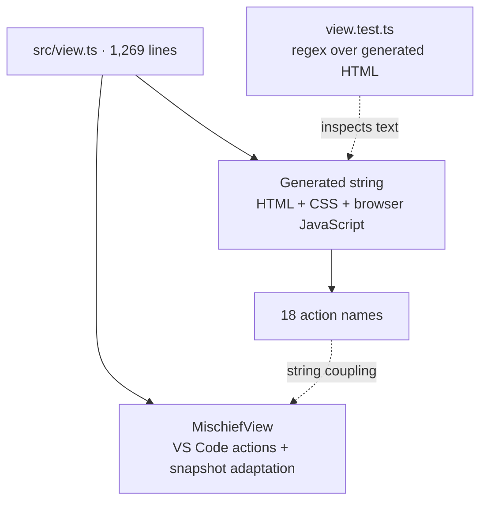
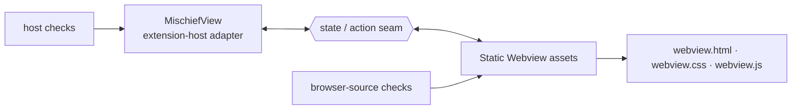
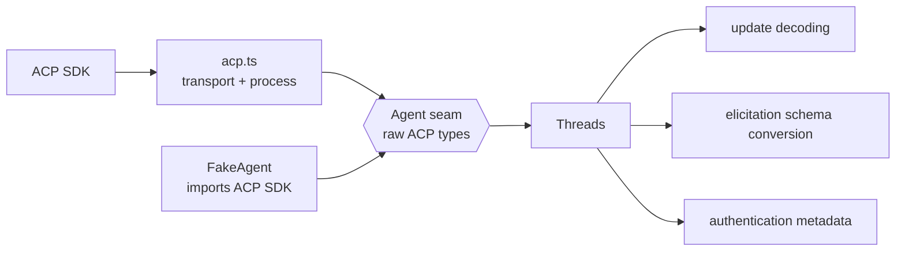
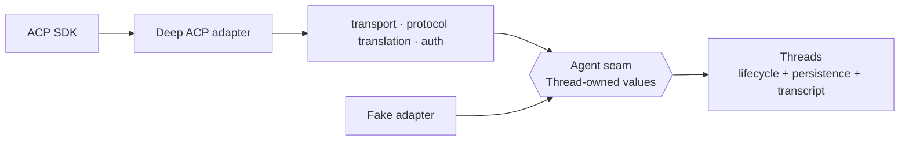
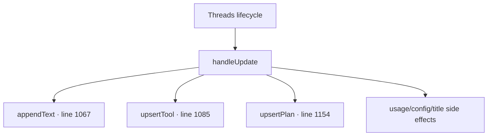
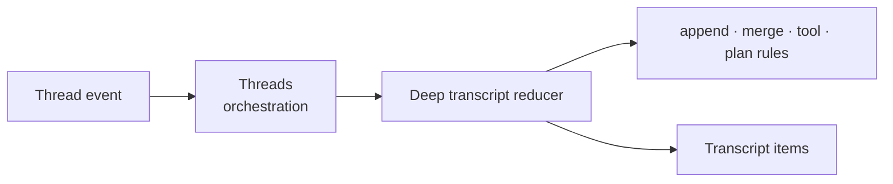

# Architecture review: Mischief

**Reviewed:** 2026-08-28  
**Baseline:** `main` at `2b87fed`, including the current working-tree edits  
**Scope:** all source modules, biased toward the monolithic hot spots named by the request

## Scan summary

| Area | Evidence | Read |
| --- | --- | --- |
| `src/view.ts` | 1,269 lines; changed in 6 of 8 commits; contains the extension-host adapter plus an ~840-line HTML/CSS/browser-script string | Strong deepening opportunity |
| `src/threads/threads.ts` | 1,431 lines; changed in 3 of 8 commits; imports 11 ACP SDK types and owns lifecycle, protocol translation, transcript reduction, interactions, and persistence | Keep the public module deep; move two internal responsibilities behind earned seams |
| `src/projects/` | 266 source lines across `projects.ts` and `git.ts`; behavior is tested through the `Projects` interface | Leave alone |

The recommendations preserve the decisions in `CONTEXT.md`: `Projects` and `Threads` remain the deep domain modules, the Webview remains a thin VS Code adapter, and ACP remains internal to `threads/`.

## Candidates

### 1. Separate the Webview runtime from the extension-host adapter

**Recommendation strength:** **Strong**  
**Dependency category:** remote but owned — VS Code `postMessage` seam  
**Files:** `src/view.ts`, `src/view.test.ts`; likely one new internal Webview module

**Problem:** `src/view.ts` contains two runtimes in one file: `MischiefView` runs in the extension host, while the generated HTML, CSS, and browser JavaScript run in the Webview. The browser implementation sits inside a string, so TypeScript and Oxlint cannot inspect it, 18 browser actions are coupled by string names, and the main test verifies structure with regular expressions.

**Solution:** Store the browser runtime as real static assets such as `media/webview.html`, `media/webview.css`, and `media/webview.js`, behind the existing state/action message seam. VS Code still requires assigning the loaded document to `webview.html`; load that file in the extension host, replace only CSP/asset placeholders, and resolve CSS and JavaScript through `webview.asWebviewUri(...)`. Leave `MischiefView` focused on VS Code actions and adapting `Projects` and `Threads` snapshots.

**Deletion test:** Deleting that Webview module would spill all markup, rendering, pane behavior, interactions, and composer behavior back into the host adapter. It earns a deep module.

**Benefits**

- **Locality:** browser changes stay together
- **Leverage:** one document entry point
- **Locality:** host actions stay in host
- Browser code becomes directly lintable and checkable without parsing an interpolated TypeScript string
- Markup, styles, and browser behavior can change independently
- Existing domain modules stay untouched
- No UI framework required

**Tests:** Keep focused host tests for snapshot posting, action routing, static-asset URI resolution, and CSP placeholder replacement. Check the HTML and browser source files directly instead of searching one interpolated string. Add a DOM test dependency only if real browser defects justify it.

#### Before

#### After

---

### 2. Deepen the existing ACP adapter

**Recommendation strength:** **Strong**  
**Dependency category:** true external — production ACP adapter plus fake adapter  
**Files:** `src/threads/acp.ts`, `src/threads/threads.ts`, `src/threads/threads.test.ts`

**Problem:** The Agent seam is real, but ACP protocol details leak through it. `threads.ts` imports raw SDK request, response, update, configuration, and schema types; it also decodes authentication metadata, elicitation schemas, tool updates, usage updates, and session information. The fake adapter consequently imports ACP SDK types too.

**Solution:** Deepen `acp.ts` so it translates raw ACP traffic into Thread-owned events, interactions, configuration, and errors before crossing the existing Agent seam. Keep Thread lifecycle, persistence, queueing, unread state, and transcript behavior in `Threads`.

**Deletion test:** Deleting the deepened adapter would spread process startup, ACP initialization, protocol decoding, authentication decoding, and interaction translation into both `Threads` and its fake. That complexity belongs behind this seam.

**Benefits**

- **Locality:** ACP changes stay in adapter
- **Leverage:** one Thread event vocabulary
- `Threads` stops importing ACP SDK
- Fake adapter becomes protocol-agnostic
- Public `Threads` behavior stays stable
- Existing high-level tests survive

**Tests:** Keep `threads.test.ts` crossing the `Threads` interface with the fake adapter. Give ACP translation a small adapter check for protocol-specific mappings.

#### Before

#### After

---

### 3. Give transcript reduction its planned internal module

**Recommendation strength:** **Worth exploring**  
**Dependency category:** in-process  
**Files:** `src/threads/threads.ts`, `src/threads/threads.test.ts`; planned `src/threads/transcript.ts`

**Problem:** Transcript reduction now spans `handleUpdate`, `appendText`, `upsertTool`, `upsertPlan`, and `stringify`, split between the class and helpers assigned hundreds of lines later. Understanding one streamed update requires moving across the file, while the test suite exercises most reduction through one broad “rich updates” sequence.

**Solution:** Move append, merge, and upsert behavior into one internal transcript module. `Threads` should continue to own turn orchestration and expose the same public interface. This is the conditional `transcript.ts` already anticipated by `CONTEXT.md`; the reduction behavior now earns it.

**Deletion test:** Deleting the transcript module would return event-shape branching and mutation rules to the Thread lifecycle implementation. The complexity would spread rather than disappear.

**Benefits**

- **Locality:** merge rules stay together
- **Leverage:** one reduction path
- `Threads` lifecycle becomes readable
- External interface does not grow
- Deterministic edge cases become cheap
- No adapter or dependency needed

**Tests:** Preserve the current `Threads` tests. Add focused internal checks only for merge edge cases such as repeated message IDs, tool updates, and terminal-output appends.

#### Before

#### After

## Top recommendation

**Start with candidate 1: separate the Webview runtime from the extension-host adapter.** It is the clearest real seam, `view.ts` is the hottest file, and the current regex-based test exposes the largest testability gap.

Then deepen the ACP adapter. Reassess transcript reduction afterward so protocol translation and transcript behavior are not moved twice.

## Guardrails

- Do **not** split the public `Threads` module into persistence, queue, configuration, and lifecycle classes. Its size is not itself shallowness; its interface currently provides real leverage and its tests already cross the intended seam.
- Do **not** create generic `shared/`, `utils/`, event-bus, factory, or pass-through persistence modules.
- Do **not** extract type-only or constant-only files to reduce line counts.
- Keep the Webview browser implementation framework-free unless measured UI complexity demands otherwise.
- No implementation interface is proposed here; choose one candidate before designing it.
