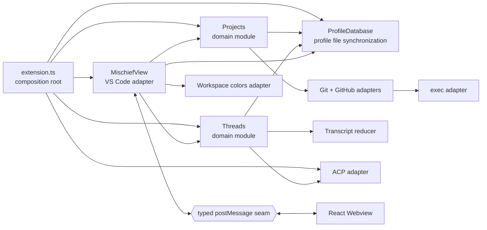

# Codebase architecture and Ponytail review

**Reviewed:** 2026-09-21  
**Baseline:** `dev` at `5a6f54f` (`update apc`)  
**Method:** Ponytail over-engineering review plus Matt Pocock's deep-module/codebase-design guidance  
**Implementation status:** all accepted recommendations were applied in the review worktree; Workspace Git metrics were explicitly retained for likely future use

## Executive summary

Mischief's architecture is healthy. Its major modules are deep, dependency direction is understandable, external protocols are translated at the right seams, and there are no runtime import cycles. The large files are mostly large because they hide real behavior, not because they collect pass-through layers.

No broad rewrite or new architecture layer is warranted. The accepted cleanup:

- narrowed Thread snapshot/configuration interfaces;
- replaced the custom process runner with Node's `execFile`;
- consolidated repeated VS Code loading-picker lifecycle;
- moved Workspace swatch outlining to CSS;
- removed brittle CSS source-text tests and small dead/shallow code; and
- removed or shortened stale, noncanonical plans.

The implementation diff against the baseline, excluding this new report, is **98 additions and 1,961 deletions: net −1,863 lines**. Most deletion is stale planning material; code, tests, and CSS account for about 200 net removed lines. No dependency was added.

## Scope and method

The review covered:

- `CONTEXT.md`, ADR-0001, linked plans, agent/domain guidance, and the earlier architecture review;
- every production TypeScript/TSX module and the Webview shell/styles;
- tests, fixtures, major fakes, and intended interface-level seams;
- imports, exports, runtime/type-only cycles, dependency usage, source churn, and dead presentation data;
- relevant Git history and blame for apparent leftovers; and
- canonical GitHub issue state where checked-in plans disagreed with current behavior.

This was an architecture and over-engineering review, not a separate correctness, security, accessibility, or performance-bug audit.

## Repository snapshot after cleanup

| Measure                   |                        Result |
| ------------------------- | ----------------------------: |
| Production TypeScript/TSX |                   9,848 lines |
| Test TypeScript/TSX       |                   7,711 lines |
| Webview CSS               |                   1,516 lines |
| Runtime dependencies      |                   5; all used |
| Runtime import cycles     |                             0 |
| Type-only cycles          | 2, both internal and harmless |
| Final verification        |                See Validation |

The type-only cycles are:

- `projects/projects.ts` ↔ `projects/github.ts` for `GitHubIssue`;
- `threads/threads.ts` ↔ `threads/transcript.ts` for Thread-owned values.

Neither creates a runtime cycle. Moving those types solely to make the graph visually acyclic would add navigation without leverage.

## Architecture map

## Deep-module assessment

| Module | Dependency category | Assessment | Decision |
| --- | --- | --- | --- |
| `ProfileDatabase` | Local-substitutable filesystem | **Deep.** A small interface hides files, validation, atomic replacement, polling, ownership, ordering, and migration. | Keep intact. Do not add a database, watcher, broker, lock manager, or repository wrapper. |
| `Projects` | Local Git plus true-external `gh` | **Deep.** It hides canonicalization, discovery, grouping, Git config, issue decoding, worktree creation, and useful Git metadata. | Keep the Workspace Git metrics. Their collection and interface fields are an explicit product decision for future use. |
| `Threads` | In-process state plus injected Agent port and Profile Database | **Deep despite its size.** Its methods enforce shared selection, persistence, queue, interaction, retry, unread, and session-operation invariants. | Do not split it into lifecycle, queue, persistence, or configuration classes. |
| `AgentConnection` seam | True external ACP Agent | **Real seam.** It has a production ACP adapter and a test fake. Raw ACP SDK types remain in `acp.ts`. | Keep. The fake and production adapter justify the seam. |
| `AcpConnection` | True external ACP process/protocol | **Deep adapter.** It owns process lifecycle, initialization, translation, auth, elicitation, private methods, and payload validation. | Keep its boundary validation even where verbose. |
| Transcript reducer | In-process | **Earned internal seam.** Append/merge/tool/plan rules are localized and focused. | Keep internal; do not promote it into a public abstraction. |
| `MischiefView` | VS Code plus remote-but-owned Webview seam | **Deep adapter.** Its public interface is small relative to the Workspace, Thread, picker, and rendering behavior hidden inside. | Keep one adapter. The repeated loading lifecycle is now one private helper. |
| React Webview | Remote-but-owned Webview runtime | **Earned.** Navigator state, transcript streaming, drafts, forms, controls, and accessibility behavior justify React. | Do not add another framework or state library. |
| Workspace colors | VS Code plus local files | **Deep.** Four useful entry points hide theme lookup, JSONC preservation, color math, and two write paths. | Keep. Presentation-only swatch contrast now stays in CSS. |

## What is designed well

### Prior architecture work landed at the right seams

The 2026-08-28 review recommended three changes. All three now exist:

- browser code moved out of the host adapter into real HTML/CSS/TypeScript;
- ACP SDK types and protocol translation moved behind `src/threads/acp.ts`; and
- transcript reduction earned `src/threads/transcript.ts` plus focused tests.

These changes improved locality without widening domain interfaces.

### Boundary validation is justified

The long validation paths below should not be “simplified” away:

- `src/profile-database/profile-database.ts` validates durable profile records;
- `src/threads/acp.ts` validates ACP/private MagPi payloads and form responses;
- `src/projects/github.ts` validates `gh` JSON and HTTPS issue URLs; and
- `src/view.ts` validates untrusted Webview messages and pasted images.

This complexity prevents invalid state and belongs behind the relevant seams.

### Tests generally cross intended interfaces

- Profile Database uses temporary real directories.
- Projects uses temporary real Git repositories and a fake `gh` executable.
- Threads crosses its public interface with a fake Agent adapter and real Profile Database.
- ACP has focused protocol-translation checks.
- The Webview is exercised through typed messages and accessible DOM behavior.

The large `FakeAgent` is not speculative infrastructure: it is the second adapter at a real seam and supports the domain suite.

### Dependencies are justified

No runtime dependency is removable without replacing it with more code:

- ACP SDK implements the protocol;
- `jsonc-parser` edits unopened Workspace JSONC without destroying comments;
- `markdown-it` renders Markdown with raw HTML disabled; and
- React/ReactDOM support the current stateful Webview.

### Suspicious-looking code that should stay

- `button-tooltip.tsx` exists because the product wants immediate, styled tooltips; native `title` timing is not controllable.
- The inline SVG icon set avoids a runtime package and asset-copy pipeline. Only its unused `spool` glyph was removed.
- Profile Database polling is deliberately simple and cross-process. A watcher or IPC layer would add failure modes without measured need.
- ACP/private MagPi decoders isolate untrusted payloads. Generic schema machinery would add a dependency and obscure protocol errors.
- Durable and runtime Thread state serve different ownership needs: synchronization versus live Agent connections and transcripts.
- Workspace `changes`, `ahead`, `behind`, and `linked` metadata are intentionally retained for potential future presentation.

## Applied recommendations

### 1. Narrowed Thread interfaces

`ThreadSummary.status` and `ThreadSummary.createdAt` crossed the domain/Webview seam without a consumer. They were removed; lifecycle and ordering still retain those values in durable Thread records.

Configuration choice descriptions and option categories also crossed the ACP, Threads, and Webview seams without being rendered. They were removed while top-level configuration descriptions remain available to controls.

**Result:** smaller snapshots and fewer fixtures without changing behavior.

### 2. Replaced the custom process implementation

`src/exec.ts` manually spawned processes, drained streams, decoded an untyped close tuple, and reconstructed process errors. It now uses promisified `node:child_process.execFile`, preserving no-shell execution and the existing shared call site.

**Result:** the adapter dropped from 52 lines to 12 lines, with Projects integration tests still exercising real Git and the fake `gh` executable.

### 3. Consolidated cancellable loading QuickPicks

Fork targets, tree targets, and Thread history repeated the same busy picker, cancellation, hide, and disposal lifecycle. `MischiefView` now owns one private generic helper used by all three operations.

**Result:** one cleanup path, including error cleanup for Thread history, without introducing a picker service or new module.

### 4. Removed CSS source parsing from tests

Five `view.test.ts` cases regex-matched exact CSS declarations and selector ordering. They could fail on behavior-preserving refactors and pass malformed visual output.

The static HTML/asset smoke check remains. DOM/message behavior remains in jsdom. Visual layout, palette, wrapping, and compactness remain part of the Extension Development Host manual matrix; no browser-test dependency was added solely to replace regexes.

### 5. Moved Workspace swatch outlining to CSS

The Navigator no longer parses and rescales hexadecimal colors in JavaScript for a one-pixel outline. The existing `.workspace-color` rule now uses the HumanLayer foreground token for its box shadow.

### 6. Removed small dead and shallow code

- removed the unused `spool` glyph;
- changed post-class mutable Thread helper assignments into ordinary constants;
- reused the shared `isRecord` guard in Profile Database;
- inlined the one-caller five-line `Toast` component; and
- removed redundant process encoding options from callers.

### 7. Cleaned stale planning artifacts

- deleted the 574-line noncanonical GitHub Workspace plan after implementation;
- deleted the 77-line superseded message-history plan;
- changed the Profile Database plan status from **Proposed** to **Implemented**; and
- replaced the 1,046-line MagPi migration plan with a short implemented compatibility record that reflects canonical issue #28's naming decision.

Git history and canonical GitHub issues retain implementation archaeology without presenting stale requirements to future agents.

## Ponytail result

`src/threads/threads.ts; src/threads/acp.ts: delete: unconsumed summary and configuration metadata. Applied.`

`src/exec.ts: stdlib: custom spawn/stream/close wrapper replaced by promisified execFile. Applied.`

`src/view.ts: shrink: three loading-QuickPick lifecycle copies replaced by one private helper. Applied.`

`src/webview/navigator-pane.tsx; media/webview.css: native: JavaScript color parser replaced by CSS. Applied.`

`src/view.test.ts: delete: visual CSS source parsing removed; existing behavior tests and manual visual verification remain. Applied.`

`src/webview/icon.tsx; src/webview/toast.tsx; src/profile-database/profile-database.ts: delete/shrink: dead glyph, shallow file, and duplicate guard removed. Applied.`

`docs/github-issue-workspace-plan.md; docs/done/history-feature-plan.md; docs/magpi-acp-native-session-migration-plan.md: delete/shrink: stale noncanonical planning reduced to current compatibility facts. Applied.`

`src/projects/git.ts; src/projects/projects.ts: keep: Workspace Git metrics are intentionally retained for likely future use by explicit product decision.`

**net applied: −1,863 lines against existing files, excluding this report.**

## Test architecture after cleanup

### Strong seams

- Profile Database verifies synchronization and ownership through its public interface.
- Projects uses real Git rather than inventing a Git port merely for mocks.
- Threads uses the real Profile Database plus a fake Agent adapter.
- ACP checks protocol translation at the adapter boundary.
- Webview tests use messages and accessible DOM behavior rather than component internals.

### Remaining risks and decisions

| Risk | Decision |
| --- | --- |
| Host test concentration in `src/view.test.ts` | Do not add a framework. Reuse a tiny local builder only when another identical fixture appears. |
| One broad Workspace color test | Leave it unless failures become hard to diagnose; splitting now adds ceremony without coverage. |
| Projects integration suite dominates test time | Keep real Git because it is the correct local-substitutable seam; optimize only after measured CI pain. |
| Visual CSS regressions are not browser-automated | Keep the Extension Development Host visual matrix; add a browser harness only for broader independently justified coverage. |

## Churn and maintenance concentration

Historical churn remains concentrated where product behavior is concentrated:

| File | Historical commits | Historical added + deleted lines |
| --- | --: | --: |
| `src/view.test.ts` | 39 | 4,345 |
| `src/threads/threads.ts` | 26 | 4,105 |
| `src/view.ts` | 34 | 3,679 |
| `src/threads/threads.test.ts` | 22 | 3,124 |
| `src/webview/app.test.tsx` | 30 | 2,650 |
| `media/webview.css` | 36 | 2,165 |
| `src/threads/acp.ts` | 21 | 1,994 |

This does not justify splitting by line count:

- `Threads` concentrates shared invariants;
- `AcpConnection` contains a true external protocol;
- `MischiefView` is the single VS Code adapter; and
- React components hide substantial behavior behind small prop interfaces.

## Guardrails

Do not introduce:

- repositories over Profile Database, Projects, or Threads;
- a dependency container, event bus, command bus, or generic action dispatcher;
- separate queue/configuration/lifecycle classes under Threads;
- another Webview state store or React state library;
- a Git/GitHub SDK while process adapters remain sufficient;
- a watcher, IPC server, or lock manager before polling is measurably inadequate;
- a new icon or tooltip dependency; or
- type-only files merely to eliminate harmless type-only cycles.

Do preserve:

- trust-boundary validation;
- the injected Agent port and fake adapter;
- atomic Profile Database writes and ownership checks;
- typed Webview messages;
- accessibility labels and native controls;
- retained Workspace Git metadata for future use; and
- one runnable check for every new nontrivial behavior.

## Validation

Before implementation, `pnpm check` passed format, lint, typecheck, 148 tests, bundle, and extension smoke import.

After implementation, `pnpm check` again passed format, lint, typecheck, all **143 remaining tests in 10 files**, bundle, and extension smoke import. The five removed tests were the CSS source-regex assertions described above.

## Conclusion

Mischief should keep its present module boundaries. The cleanup made existing deep modules narrower and more local without adding abstractions. No further architecture migration is recommended from this review.
